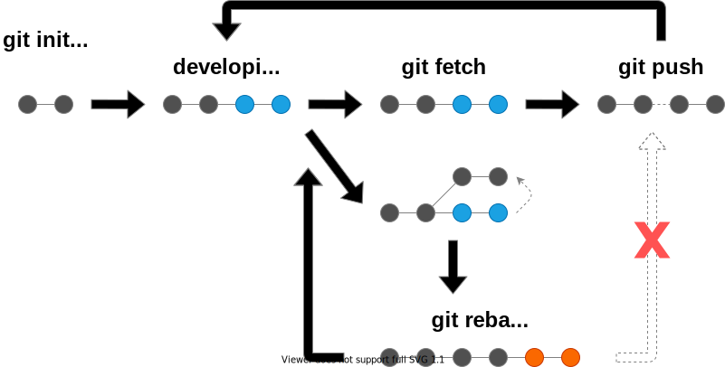
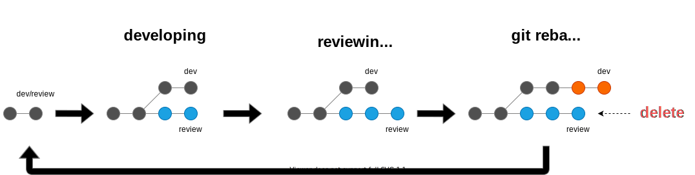

<!-- _class: lead -->
# Git版本管理及工程实践

</br>
</br>
</br>

**黄善洛 slhuang**
**2022/05**

---
<!-- paginate: true -->


## 抛弃各种Flow
</br>

- 流程复杂
- 交付周期长
- 难以成功实践

---
</br>

## 版本管理模式

- **分支开发 vs 主干开发**
分支开发：为一个或多个特定的需求/问题创立分支，在其上实现相应的开发后把它合并主干/集成分支
主干开发：直接向主干提交/推送代码，开发团队的成员1天至少1次地将代码提交到主干分支，在到达发布条件时，从主干拉出发布分支（通常就只是主干上某个提交）

- **独立代码仓库 vs 单体代码仓库 (monolithic repository)**
独立代码仓库：每个项目单独一个仓库
单体代码仓库：所有项目的代码都放在同一个代码仓库里，只按目录划分项目和模块

---
**分支开发的优点：**
1. 特性开发周期宽松
2. 分支测试的时间宽松

**分支开发的缺点：**
1. 分支管理复杂
2. 合并冲突多，解决困难
3. 迭代速度慢
4. 需要较多测试环境

---

**主干开发的优点：**
1. 分支模型简单高效，开发人员易于掌握不容易出现错误操作
2. 避免了分支合并、冲突解决的困扰
3. 随时拥有可发布的版本
4. 有利于持续集成和持续交付

**主干开发的缺点：**
1. 对代码质量要求高，低质量代码将直接阻塞整个团队的开发工作，需要高效的持续集成平台进行把关
2. 自动化测试要求高，需有完备单元测试代码
3. 要求有配套的代码评审机制

---
</br>

**独立仓库的优点：**
1. 代码历史清晰，不会跟其他模块或项目混淆
2. 合并代码时冲突概率小
3. 编译速度快
4. 单测速度和持续集成速度快
5. 发布速度快

**独立仓库的缺点：**
1. 项目代码不容易规范
2. 项目集成和部署会比较麻烦
3. 开发人员缺乏对整个项目的整体认知
4. 项目间冗余代码多
4. 依赖管理困难

---
</br>
</br>

**单体仓库的优点：**
1. 统一的版本，唯一的可信来源
2. 原子性变更
3. 简单而可靠的依赖管理
4. 大规模代码共享与重用的可能性
5. 大规模重构的可能性
6. 代码可见性和清晰的代码树结构

**单体仓库的缺点：**
1. 权限难以控制，开发人员可能接触到项目所有代码
2. 开发测试部署和扩展，需要集中管理集中协调
3. 代码量和复杂性不受控
4. 需要独立的代码管理和复杂的配套工具

---

## 启发
- **版本管理的核心目标：效率和质量**
- **单体代码和主干开发实现高效和高质量源于简单**
- **如何用git的方式实现单体代码和主干开发**

---
## Git模拟单体代码
- 首先，Git并不适合管理单体代码
- 代码设计模块化，降低耦合度，通过submodule复用


---

## submodule


```bash
$ git submodule add ${sub_repo_url}
$ git submodule update
```

相较于复制粘贴
- 代码会包含在单独的repository中，不会“泄漏”到主项目
- 可以便捷地跟踪子项目的更新，随时同步修改
- 子项目的提交历史也可以纳入主项目中，便于版本管理

---

## Git实现主干开发
- 弃用merge
- 使用rebase/cherry-pick
- 不要存在并行分支

---
## rebase vs merge
</br>
</br>

| | 优点 | 缺点 |
| :----:| :----: | :----: |
| merge | 操作简单，保全历史 | 不便追查，容易混乱，远端被动 |
| rebase | 线性可读，易于管理，远端主动 | 历史被随意篡改，操作相对麻烦 |

</br>
</br>

---
**期望的merge效果**


---
**真实的merge效果**


---

**rebase效果**


---
</br>
</br>

## 使用rebase/cherry-pick实现主干开发


</br>

**release:** 只需在对应提交处打tag，并推进master即可

---
</br>

## review机制

**使用合并请求 (pull request / merge request)**


---
</br>
</br>


---
</br>

**使用review分支**

</br>

- 临时分支，不要长期存放代码
- 只用作review目的，需要及时处理，不要当成普通分支使用

---
## 其它相关话题

### 配置文件
- 将配置文件也纳入版本管理
- 配置文件尽可能保持向后兼容性

</br>

### 测试
- 采用[TDD(Test-Driven Development)](https://baike.baidu.com/item/TDD/9064369?fr=aladdin)
- 构建[持续集成(Continuous integration)](https://baike.baidu.com/item/%E6%8C%81%E7%BB%AD%E9%9B%86%E6%88%90/6250744?fr=aladdin)
